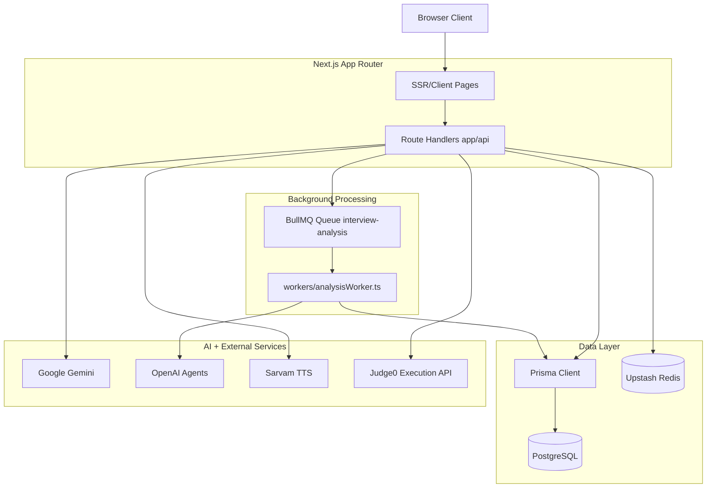
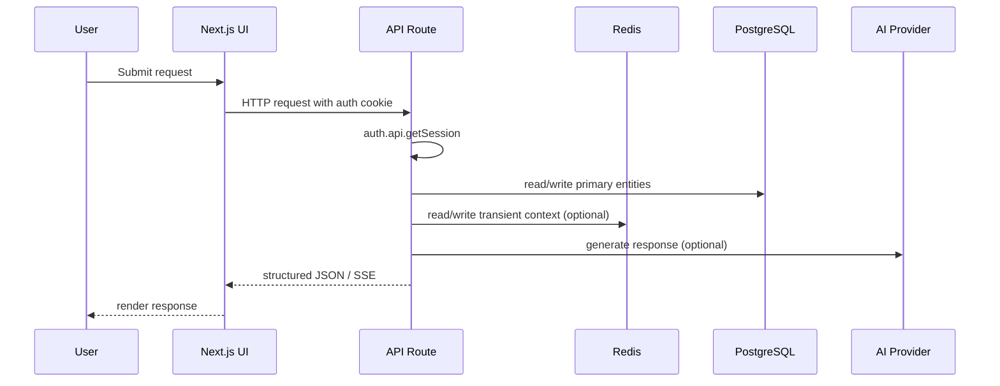
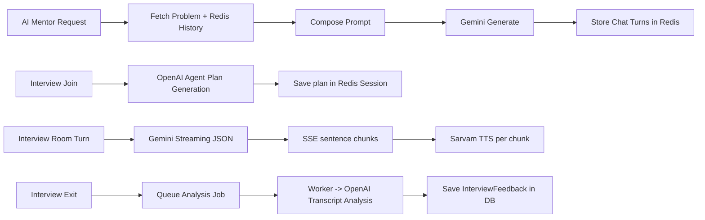
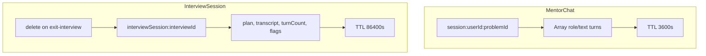
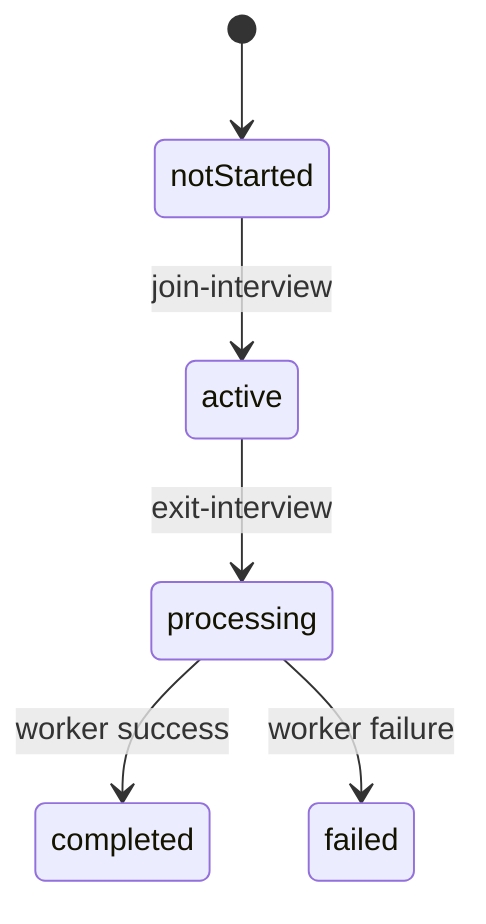
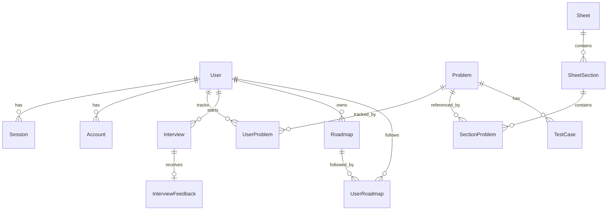

# BaseCase - Comprehensive Technical Documentation

This document explains the implementation details of BaseCase directly from the current codebase.

---

## 1. Complete System Architecture

### 1.1 Component Overview

BaseCase is a Next.js App Router application with API handlers under `app/api`, Prisma/PostgreSQL persistence, Redis-backed transient session state, and a BullMQ worker for asynchronous interview analysis.

Core runtime components:

- Web app and APIs: Next.js 16
- Auth: Better Auth with Prisma adapter
- Primary DB: PostgreSQL via Prisma
- Transient state: Upstash Redis (`@upstash/redis`)
- Async jobs: BullMQ queue + worker
- AI providers:
  - Gemini (`@google/genai`) for coding mentor and interview room responses
  - OpenAI Agents (`@openai/agents`) for interview planning and transcript analysis
  - Sarvam AI TTS for spoken interview output
- Code execution: Judge0

### 1.2 High-Level Architecture Diagram

### 1.3 Data Flow Diagram

### 1.4 AI Pipeline Architecture

### 1.5 Redis Caching Architecture

### 1.6 Chat/Interview Session Lifecycle

---

## 2. Detailed Pipeline Explanations

### 2.1 Chat Message Pipeline (`/api/ai-agent`)

Implementation sources:

- `app/api/ai-agent/route.ts`
- `lib/session.ts`

Flow:

1. Validate user session via Better Auth.
2. Validate payload (`problemId`, `message`) via Zod.
3. Fetch problem from Prisma.
4. Fetch Redis history key: `session:{userId}:{problemId}`.
5. Build prompt from problem metadata + prior turns.
6. Call Gemini model (`process.env.GEMINI_MODEL_NAME`).
7. Append user/model turns and write back to Redis with TTL = 1 hour.
8. Return generated response.

GET on the same route returns cached chat history for the problem scope.

### 2.2 Interview Session Lifecycle Pipeline

Primary routes:

- `app/api/interview/new-interview/route.ts`
- `app/api/interview/[interviewId]/join-interview/route.ts`
- `app/api/interview/[interviewId]/join-interview/room/route.ts`
- `app/api/interview/[interviewId]/exit-interview/route.ts`
- `app/api/interview/[interviewId]/report/route.ts`

Detailed flow:

1. **Create interview**:
   - Auth check.
   - Validate payload (mode/company/difficulty/questions).
   - Transaction:
     - Decrement `user.interviewCredits` (`where interviewCredits > 0`).
     - Create `Interview` record.

2. **Join interview**:
   - Ensure interview belongs to user and status is `notStarted`.
   - Generate interview plan using OpenAI Agent planner prompt.
   - Build greeting message and synthesize via Sarvam TTS.
   - Save Redis interview session (`interviewSession:{interviewId}`) with plan + transcript seed.
   - Update interview status to `active`.

3. **Room turn processing (SSE)**:
   - Append user utterance to Redis transcript via `appendToTranscript`.
   - Call Gemini streaming API with strict JSON output instructions.
   - Parse streamed tokens into sentence chunks.
   - For each chunk, synthesize TTS and emit SSE payload `{ type: "chunk", seq, text, audio }`.
   - Emit `{ type: "done", isComplete, isEnding }` metadata.
   - Persist AI message back into Redis transcript.

4. **Exit interview**:
   - Read interview session from Redis.
   - Update interview status to `processing`, set `completedAt`.
   - Delete Redis session key.
   - Enqueue BullMQ job `interview-analysis` with transcript + mode.

5. **Report retrieval**:
   - Query `InterviewFeedback` joined with interview metadata, owner-scoped.

### 2.3 AI Insight Generation Pipeline (Worker)

Implementation source:

- `workers/analysisWorker.ts`

Flow:

1. Worker consumes `interview-analysis` jobs with concurrency 2.
2. Transcript is normalized to interviewer/candidate turn blocks.
3. OpenAI Agent runs analysis prompt returning JSON.
4. Worker parses output and writes `InterviewFeedback` record.
5. Marks interview as `completed` on success, `failed` on error.
6. BullMQ retry config from enqueue call: attempts = 2, exponential backoff.

### 2.4 Problem Execution Pipeline

Routes:

- `app/api/problems/[problemSlug]/problem/execute/route.ts`
- `app/api/problems/[problemSlug]/problem/submit/route.ts`

Flow:

1. Validate session.
2. Map language to Judge0 language ID (`lib/judge0.ts`).
3. Base64-encode source and stdin.
4. Submit async to Judge0 and poll result endpoint.
5. Decode outputs and shape result payload.
6. For submission route:
   - Run against ordered test cases from DB.
   - Preserve private test-case secrecy (input/expected hidden when private).
   - Upsert `UserProblem` attempts and solved state.

### 2.5 Roadmap Generation Pipeline

Route:

- `app/api/roadmap/route.ts` (POST)

Flow:

1. Auth + request validation.
2. Check `roadmapCredits` before expensive AI call.
3. Fetch candidate problems filtered by prep-level difficulty.
4. Use OpenAI Agent with schema-constrained output (`outputType`).
5. Transaction:
   - Persist roadmap JSON payload to `Roadmap.data`.
   - Decrement user roadmap credits.

---

## 3. Redis Caching Architecture

### 3.1 Key Design

Defined in `lib/session.ts`:

- `session:{userId}:{problemId}` for mentor chat turns.
- `interviewSession:{interviewId}` for active interview room state.

### 3.2 Value Shapes

Mentor key value:

- `Array<{ role: string; text: string }>`

Interview key value:

- `plan`
- `transcript: string[]`
- `isGreetingDone: boolean`
- `turnCount: number`
- `mode, company, difficulty, questionLimit`

### 3.3 TTL Strategy

- Mentor chat TTL: `60 * 60` seconds.
- Interview session TTL: `60 * 60 * 24` seconds.

### 3.4 Cache Invalidation

- Mentor history invalidates via TTL only.
- Interview session invalidates by:
  - explicit `deleteInterviewSession(interviewId)` on exit
  - TTL fallback for orphaned sessions

### 3.5 Performance Benefits

- Avoids frequent DB writes per conversational turn.
- Enables low-latency, stateful chat/interview interactions.
- Decouples transient conversational state from durable analytics state.

---

## 4. Database Design

### 4.1 ORM and Connection Strategy

- Prisma client generated to `generated/prisma`.
- Prisma uses `@prisma/adapter-pg` with `DATABASE_URL`.
- Global singleton pattern prevents hot-reload connection explosion.

### 4.2 Primary Models (`prisma/schema.prisma`)

Auth/account:

- `User`, `Session`, `Account`, `Verification`

DSA content/progress:

- `Problem`, `TestCase`, `UserProblem`, `Sheet`, `SheetSection`, `SectionProblem`

Interview:

- `Interview`, `InterviewFeedback`

Roadmap:

- `Roadmap`, `UserRoadmap`

Feedback:

- `Suggestion`

### 4.3 Relationship Diagram

### 4.4 DB and Redis Interaction Boundaries

- Durable entities (progress, interviews, reports, roadmaps) persist in Postgres.
- Ephemeral conversational/interview turn state lives in Redis.
- Worker consumes transcript payload after Redis deletion and writes finalized report to DB.

---

## 5. AI Architecture

### 5.1 AI Use Cases and Providers

1. **Coding mentor**: Gemini via `app/api/ai-agent/route.ts`.
2. **Interview planner**: OpenAI Agents in `join-interview/route.ts`.
3. **Interview turn generation**: Gemini streaming in `join-interview/room/route.ts`.
4. **Interview analysis**: OpenAI Agents in `workers/analysisWorker.ts`.
5. **Voice output**: Sarvam TTS in join and room routes.

### 5.2 Prompting and Output Discipline

- Mentor includes strict behavior constraints to stay problem-focused.
- Room prompt enforces valid JSON-only output with completion metadata.
- Worker prompt enforces structured scoring dimensions and JSON schema.
- Roadmap route uses Zod schema as `outputType` for typed response shaping.

### 5.3 Chat History / Memory Use

- Problem mentor uses Redis conversation history to maintain context.
- Interview room uses Redis transcript + plan as short-term memory.
- No vector-store or RAG retrieval system exists in the current codebase.

---

## 6. Performance Design Decisions

### 6.1 Why Redis for Session State

Observed implementation intent:

- High-frequency conversational writes are handled in Redis.
- Postgres remains focused on durable records and analytics entities.
- TTL limits stale key growth.

Tradeoff:

- Redis key expiration can remove context if a session is idle too long.

### 6.2 Why Queue-based Analysis

Interview report analysis is heavy and variable latency.

Queueing benefits:

- Immediate API return on interview exit.
- Controlled worker concurrency.
- Retry on transient AI failures.
- Isolation of long-running workloads from request path.

### 6.3 Query Optimization Patterns

- `Promise.all` and `$transaction` used in hot paths (dashboard/interview creation/roadmap generation).
- Compound constraints and indexes in schema:
  - `@@unique([userId, problemId])`
  - `@@unique([sectionId, problemId])`
  - `@@unique([userId, roadmapId])`

### 6.4 Submission Pipeline Efficiency

- Code is base64-encoded once per submit request.
- Compile error short-circuiting avoids unnecessary testcase runs.
- Public/private test-case visibility protects hidden judge cases.

---

## 7. Scalability Considerations

### 7.1 Current Scaling-Friendly Choices

- Stateless APIs with session cookie checks.
- Redis-backed queue enables independent worker scaling.
- Prisma/Postgres relational model supports normalized growth.
- SSE streaming keeps interview generation incremental.

### 7.2 Scale Bottlenecks to Watch

- Per-testcase sequential Judge0 polling can increase latency for large suites.
- Interview room TTS per sentence adds provider-bound latency.
- Worker process currently includes an express listener; operationally separable but currently coupled in one process.

### 7.3 Practical Next Steps for Scale

1. Run multiple dedicated worker instances for queue throughput.
2. Add request-level rate limits for AI-heavy endpoints.
3. Batch or parallelize testcase execution where policy allows.
4. Add metrics around queue lag, AI latency, and Redis key churn.

---

## 8. Security Considerations

### 8.1 Authentication and Route Protection

- Most protected routes call `auth.api.getSession({ headers })`.
- Main product pages redirect unauthenticated users to sign-in.
- No global middleware auth gate; protection is route/page-level.

### 8.2 Authorization Patterns

- Ownership checks exist for many interview and roadmap operations.
- Credit-based controls guard interview and roadmap creation.

### 8.3 Security Gaps Observed in Current Code

1. `app/api/roadmap/[roadmapId]/roadmap-changes/route.ts` performs update without ownership validation.
2. `app/api/interview/[interviewId]/exit-interview/route.ts` updates by interview ID and does not verify owner in the update statement.
3. Dev seed bypass (`x-seed-key`) exists in several create routes and should be isolated from production deployments.

### 8.4 Data Handling

- Hidden test cases are not exposed in submission response payloads.
- Redis stores interview transcript text temporarily; durable copy written to `InterviewFeedback.transcript`.
- Secrets are consumed through environment variables.

---

## API Route Inventory (Implemented)

### Auth

- `GET/POST /api/auth/[...all]`

### AI Mentor

- `POST /api/ai-agent`
- `GET /api/ai-agent?problemId=...`

### Dashboard

- `GET /api/dashboard`

### Feedback

- `POST /api/feedback`

### Interview

- `GET /api/interview`
- `POST /api/interview/new-interview`
- `GET /api/interview/[interviewId]`
- `DELETE /api/interview/[interviewId]`
- `POST /api/interview/[interviewId]/join-interview`
- `PATCH /api/interview/[interviewId]/join-interview/room` (SSE stream)
- `PATCH /api/interview/[interviewId]/exit-interview`
- `GET /api/interview/[interviewId]/report`

### Problems

- `GET /api/problems`
- `POST /api/problems`
- `GET /api/problems/[problemSlug]/problem`
- `PATCH /api/problems/[problemSlug]/problem`
- `POST /api/problems/[problemSlug]/problem/execute`
- `POST /api/problems/[problemSlug]/problem/submit`
- `GET /api/problems/[problemSlug]/testcases`
- `POST /api/problems/[problemSlug]/testcases`

### Sheets

- `GET /api/sheets`
- `POST /api/sheets`
- `GET /api/sheets/[sheetSlug]/section`
- `POST /api/sheets/[sheetSlug]/section`
- `POST /api/sheets/[sheetSlug]/section/[sectionId]/section-problems`

### Roadmap

- `GET /api/roadmap`
- `POST /api/roadmap`
- `PATCH /api/roadmap/[roadmapId]/visibility`
- `PATCH /api/roadmap/[roadmapId]/roadmap-changes`

---

## Environment Variables (Observed in Source)

- `DATABASE_URL`
- `GOOGLE_CLIENT_ID`
- `GOOGLE_CLIENT_SECRET`
- `NEXT_PUBLIC_BETTER_AUTH_URL`
- `UPSTASH_REDIS_REST_URL`
- `UPSTASH_REDIS_REST_TOKEN`
- `UPSTASH_CONNECTION_BULLMQ_URL`
- `GEMINI_API_KEY`
- `GEMINI_MODEL_NAME`
- `SARVAMAI_API_KEY`
- `JUDGE0_URL`
- `NEXT_PUBLIC_APP_URL`
- `SEED_KEY`
- `NEXT_PUBLIC_GA_ID` (optional)
- `NODE_ENV`
- `PORT` (worker listen port)

---

## Deployment and Runtime Notes

- Build script: `prisma generate && next build`.
- Runtime requires both web app (`npm run dev`/`start`) and worker (`npm run worker`) for complete interview-report functionality.
- Prisma config is defined in `prisma.config.ts` and points to `prisma/schema.prisma` + migrations path.

---

## Engineering Summary

BaseCase demonstrates a production-oriented architecture pattern:

- Strong separation between synchronous API UX and asynchronous heavy analysis.
- Clear durable vs transient state split (Postgres vs Redis).
- Multi-provider AI orchestration (planning, turn generation, analysis, and TTS).
- Real feature depth across DSA practice, interview simulation, and roadmap generation.

At the same time, hardening authorization consistency and adding operational observability would be the highest-leverage improvements for production maturity.
