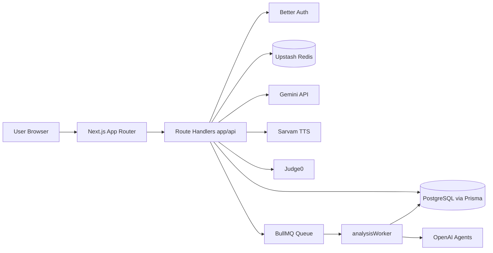
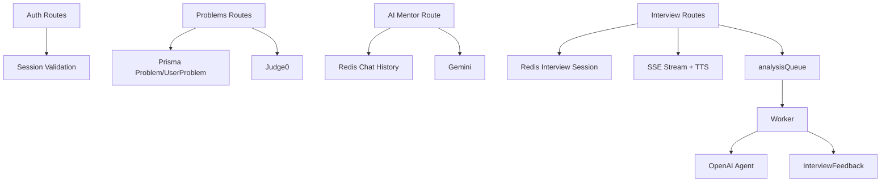
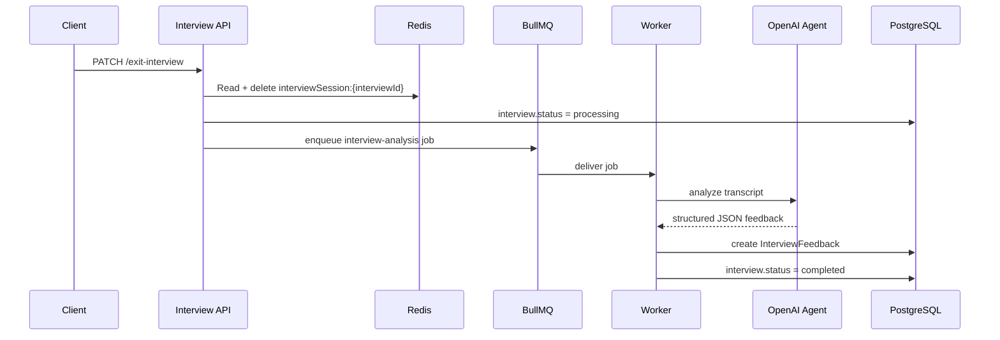
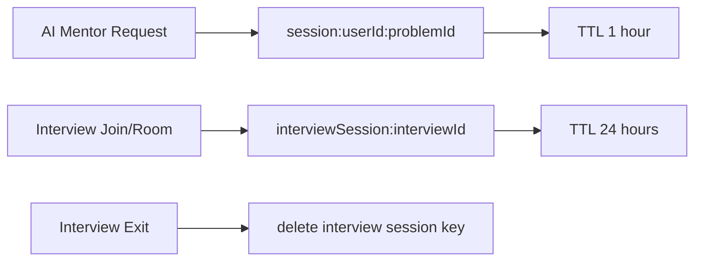

# BaseCase

Production-style DSA and interview preparation platform with AI-assisted learning, voice mock interviews, and progress analytics.

---

## 1. Project Title & Tagline

**BaseCase**: A full-stack learning platform that combines structured DSA practice with AI-powered interview simulation and actionable performance feedback.

---

## 2. Problem Statement

Preparing for coding interviews is often fragmented: learners solve random problems, lose revision context, and lack realistic interview practice.

BaseCase solves this for:

- Students and early professionals preparing for software interviews
- Candidates who want guided DSA progression instead of ad-hoc practice
- Users who need interview-grade feedback beyond pass/fail coding results

Before this workflow, users typically had to stitch together separate tools for problems, tracking, interview simulation, and analytics.

---

## 3. Solution

BaseCase unifies the entire preparation loop:

- Curated sheets and problem-level progress tracking
- Built-in code execution and judged submissions via Judge0
- AI mentor chat scoped to each problem
- Voice-first mock interviews with AI-generated plans and follow-up questions
- Async interview analysis pipeline that generates structured reports

This is effective because low-latency interactions stay in request-time APIs, while heavy analysis is offloaded to background workers.

---

## 4. Key Features

- Structured DSA sheets with ordered sections and linked problems
- Problem execution and full test-case submission flow
- AI mentor (Gemini) with per-user, per-problem Redis chat context
- Interview session lifecycle (create, join, room, exit, report)
- Streaming interview responses over SSE with chunked TTS playback
- BullMQ + Redis queue for asynchronous interview analysis
- Detailed interview report scoring (confidence, depth, communication, technical/STAR)
- AI-generated interview prep roadmaps with credit-based generation
- Dashboard analytics for difficulty progress, sheet progress, due revisions, and recent submissions

---

## 5. Tech Stack

### Frontend

- Next.js 16 (App Router)
- React 19 + TypeScript
- Tailwind CSS + shadcn/ui

### Backend

- Next.js Route Handlers (`app/api/**`)
- Better Auth (email/password + Google OAuth)
- Zod for request validation

### Data + Infrastructure

- PostgreSQL + Prisma ORM
- Upstash Redis (chat/session state)
- BullMQ worker for background analysis jobs

### AI + External Services

- Google Gemini (`@google/genai`) for mentor and interview turn generation
- OpenAI Agents (`@openai/agents`) for interview planning and report analysis
- Sarvam AI for text-to-speech interview audio
- Judge0 for code execution/submission

---

## 6. System Architecture

### High-Level Architecture



### Backend Components



### AI Processing Pipeline



### Redis Caching Layer



---

## 7. Core Pipelines

### Chat Pipeline (AI Mentor)

1. User sends `problemId + message`.
2. API validates session and problem.
3. Redis history is fetched using `session:{userId}:{problemId}`.
4. Prompt is built from problem metadata + chat history.
5. Gemini responds.
6. User/model turns are persisted back to Redis (TTL 1 hour).

### Interview Request Pipeline

1. User creates interview (`new-interview`) and credits are decremented transactionally.
2. `join-interview` generates plan via OpenAI Agent and stores interview session in Redis.
3. Room route streams interviewer responses over SSE, with chunk-level TTS.
4. On exit, transcript is queued for async analysis.

### Redis Session Flow

- Mentor: short-lived conversational context.
- Interview: active transcript + plan + counters.
- Invalidation: explicit delete on interview exit; TTL fallback for stale keys.

### Database Interaction Logic

- Prisma singleton client with PostgreSQL adapter.
- Per-user progress via `UserProblem` upsert.
- Interview lifecycle persisted in `Interview` and `InterviewFeedback`.
- Roadmap generation persists JSON roadmap payload plus ownership metadata.

### Insight Generation Pipeline

1. Worker formats transcript turns.
2. OpenAI Agent scores communication/technical dimensions.
3. Worker stores structured report and marks interview complete.

---

## 8. Project Structure

```text
app/
  (landing)/                Public landing experience
  (auth)/auth/              Sign-in / sign-up pages
  (main)/                   Authenticated product surfaces
  api/                      Backend route handlers
components/                 UI and feature modules
hooks/                      Speech/audio/custom interaction hooks
lib/                        Auth, Prisma, Redis session, queue, Judge0 helpers
prisma/                     Schema + migrations
workers/                    BullMQ analysis worker
types/                      Shared TS contracts
scripts/                    Seed and maintenance scripts
```

---

## 9. How the System Works

1. User authenticates through Better Auth (email/password or Google).
2. User solves DSA problems and updates progress (`UserProblem`).
3. User can request AI hints; cached context keeps responses problem-aware.
4. User starts an interview; plan and greeting are generated.
5. In room mode, user answers via speech; AI follow-ups stream back.
6. Ending interview enqueues analysis job.
7. Worker generates report and persists feedback.
8. Report page reads final `InterviewFeedback` for display.

---

## 10. Installation

```bash
git clone <repo-url>
cd basecase
npm install
npx prisma generate
npx prisma migrate dev --name init
```

---

## 11. Running the Project

### App

```bash
npm run dev
```

### Worker (required for interview report generation)

```bash
npm run worker
```

### Build + start

```bash
npm run build
npm run start
```

---

## 12. Environment Variables

Required (based on source usage):

```env
DATABASE_URL=

GOOGLE_CLIENT_ID=
GOOGLE_CLIENT_SECRET=
NEXT_PUBLIC_BETTER_AUTH_URL=http://localhost:3000

UPSTASH_REDIS_REST_URL=
UPSTASH_REDIS_REST_TOKEN=
UPSTASH_CONNECTION_BULLMQ_URL=

GEMINI_API_KEY=
GEMINI_MODEL_NAME=gemini-2.5-flash-lite
SARVAMAI_API_KEY=

JUDGE0_URL=

NEXT_PUBLIC_APP_URL=http://localhost:3000
SEED_KEY=

PORT=4000
NEXT_PUBLIC_GA_ID=  # optional analytics
```

---

## 13. Performance Optimizations

- **Redis state caching**: avoids DB writes for every chat/interview turn.
- **TTL-based lifecycle**: mentor and interview session keys auto-expire.
- **Async heavy processing**: interview analysis moved to BullMQ worker.
- **Parallel DB queries**: dashboard endpoints use batched `Promise.all` calls.
- **Idempotent seed/create flows**: several routes use `upsert` to avoid duplicates.

---

## 14. Future Improvements

- Harden authorization for all roadmap mutation routes
- Add dedicated route for public roadmap detail + follow lifecycle
- Persist and version interview plans for reproducibility
- Add stronger observability (job metrics, tracing, error dashboards)
- Introduce rate limiting and stricter input validation on AI-heavy routes
